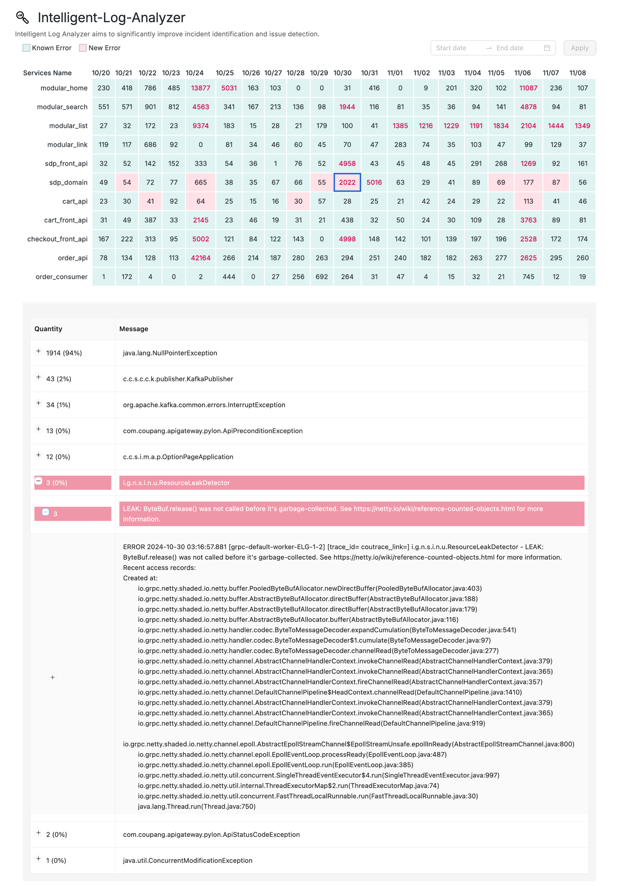

# Intelligent Log Analyzer

Intelligent Log Analyzer aims to significantly improve incident identification and issue detection.

## Key Features
- **Improved Incident Identification**: It addresses the inefficiency of manually searching and analyzing large volumes of logs (like in Loki) during online incidents. The tool subscribes to error logs, parses messages, extracts keywords, groups similar logs, and aggregates them, allowing engineers to quickly pinpoint relevant logs and understand issue causes.
- **Proactive Detection of Change-Induced Errors**: It tackles the issue of minor errors introduced during production changes (deployments, A/B tests, feature flags) going unnoticed until they escalate. The tool detects new error logs appearing during these changes immediately, enabling swift rollbacks and minimizing impact.
- **Rapid Root Cause Analysis for Major Incidents**: During major incidents with numerous alerts, the analyzer helps engineers quickly identify the root node and the specific cause of the issue by providing a real-time dashboard of error log counts, with drill-down capabilities to see detailed error information (exception category, keywords).
- **Efficient Error Log Reduction**: It automates the time-consuming task of analyzing and grouping error logs for routine error reduction. By aggregating logs and identifying top error sources, it helps engineers focus their efforts on improving code and meeting error count targets more efficiently.
- **Core Functionality**: The tool subscribes to error logs, parses and extracts keywords, groups and aggregates logs per minute, and stores this data. It provides dashboards for error count visualization and detailed error analysis, and offers new error detection signals for integration with CI/CD pipelines for automated rollbacks.



## Getting Started
**Note: This platform is designed for on-premises deployment in internal network environments. All data processing occurs within your infrastructure, ensuring sensitive data remains secure and never leaves your network.**

##### 1\. Install Intelligent Log Analyzer Server  <br>
**System Requirements:**
- **Minimum Requirements**: 4 CPU cores, 16GB RAM, 40GB storage
- **Optimal Configuration**: 8+ CPU cores, 32GB+ RAM, 40GB+ SSD storage
- **Operating System**: Linux (recommended)

<br> Prepare a Docker environment, install MySQL database, and provide MySQL configuration to the intelligent log analyzer server through environment variables. Start the server using the script:  <br>

```bash
#!/bin/bash
docker pull skylinecorp/analyzer:latest
docker run -d -p 80:80 --name analyzer-container \
  -e PYTHONUNBUFFERED=1 \
  -e DB_HOST={your_mysql_host} \
  -e DB_PORT={your_mysql_port} \
  -e DB_USER={your_mysql_username} \
  -e DB_PASSWORD={your_mysql_password} \
  -e DB_NAME={your_mysql_database} \
  skylinecorp/analyzer:latest

```
Or start with docker-compose:
```
version: '3.8'

services:
  analyzer-app:
    image: skylinecorp/analyzer:latest
    container_name: analyzer-container
    environment:
      - PYTHONUNBUFFERED=1
      - DB_HOST={your_mysql_host}
      - DB_PORT={your_mysql_port}
      - DB_USER={your_mysql_username}
      - DB_PASSWORD={your_mysql_password}
      - DB_NAME={your_mysql_database}
    ports:
      - "80:80"
    restart: unless-stopped
```
**Note:** If MySQL is installed on the local machine, you can add the following code to the analyzer server startup script:

```bash
if [ "$(uname)" = "Linux" ]; then 
   DB_HOST="localhost" 
 else 
   DB_HOST="host.docker.internal" 
 fi
```
Modify the {your_mysql_host} to $DB_HOST in the script.

##### 2\. Install Intelligent Log Analyzer plugin  <br>
Record the domain name or IP address of the analyzer server you just started. When starting the Grafana server, pass the analyzer server address as an environment variable to Grafana using the following command: (The pluginsDir can be customized accordingly)
```
cd $GRAFANA_HOME/bin
./grafana cli --pluginsDir ../data/plugins --pluginUrl https://github.com/skyline-intelligence/intelligent-log-analyzer/releases/download/v1.0.0/skylineintelligence-errorloganalyzer-app.zip --insecure plugins install skylineintelligence-errorloganalyzer-app

export GF_PLUGINS_ANALYZER_SERVER={your_analyzer_server_address}
./grafana server
```
If you're using docker-compose, use the following configuration:

Create a Dockerfile with the following content:
```
FROM grafana/grafana:latest

USER root
RUN mkdir -p /var/lib/grafana/plugins
RUN grafana cli --pluginsDir /var/lib/grafana/plugins --pluginUrl https://github.com/skyline-intelligence/intelligent-log-analyzer/releases/download/v1.0.0/skylineintelligence-errorloganalyzer-app.zip --insecure plugins install skylineintelligence-errorloganalyzer-app

USER grafana
```

Create a docker-compose.yml file with the following content:
```
version: '3.8'
services:
  grafana:
    build: 
      context: .
      dockerfile: Dockerfile
    container_name: grafana-container
    environment:
      - GF_PLUGINS_ANALYZER_SERVER={your_analyzer_server_address}
    ports:
      - "3000:3000"
    restart: unless-stopped
```
##### 3\. Enable Intelligent Log Analyzer plugin  <br>
- Log in to Grafana with administrator credentials, click on the Plugins option in the left sidebar menu.
- In the Plugins page, search for "analyzer", then click on the intelligent log analyzer plugin that appears in the search results.
- Click the Enable button in the upper right corner to activate the intelligent log analyzer plugin. After enabling the plugin, you can proceed to configure it.

##### 4\. Configure Loki Query Addresses  <br>
In the configuration page, set up the addresses for querying loki error log. Authentication methods include username+password and token.  <br>
- For example, Loki query address: https://loki.grafana.vzone1.kr.couwatch.net/api/ds/query?ds_type=loki   <br>

##### 5\. After completing the configuration, click save. Engineers can now add role list in the Roles Setting page that need to be displayed error log analysis on the Intelligent-Log-Analyzer page.

## FAQ

### 1\. Plugin Validation Failed Error
**Error Message:**
```
ERROR[06-05|11:52:27] Plugin validation failed logger=plugins.validation pluginId=skylineintelligence-errorloganalyzer-app error="plugin 'skylineintelligence-errorloganalyzer-app' has an modified signature"
```

**Solution:**
When starting Grafana and encountering this error, please use the Mac command line tool `ls -alF` to check if there are any Mac-generated `.DS_Store` hidden files in the `grafana/data/plugins/skylineintelligence-errorloganalyzer-app` directory. If such files exist, delete them and restart Grafana.

### 2\. macOS Developer Verification Issues
**Issue:**
When starting Grafana on macOS, you may encounter a popup saying "Cannot open 'gpx_error_log_analyzer_darwin_amd64' because the developer cannot be verified."

**Solution:**
1. First, click the "Cancel" button when the popup appears
2. Go to Mac System Preferences > Security & Privacy
3. Allow the program that was just blocked
4. Restart Grafana
5. When you encounter the popup "macOS cannot verify the developer of 'gpx_error_log_analyzer_darwin_amd64'. Are you sure you want to open it?", click "Open"
